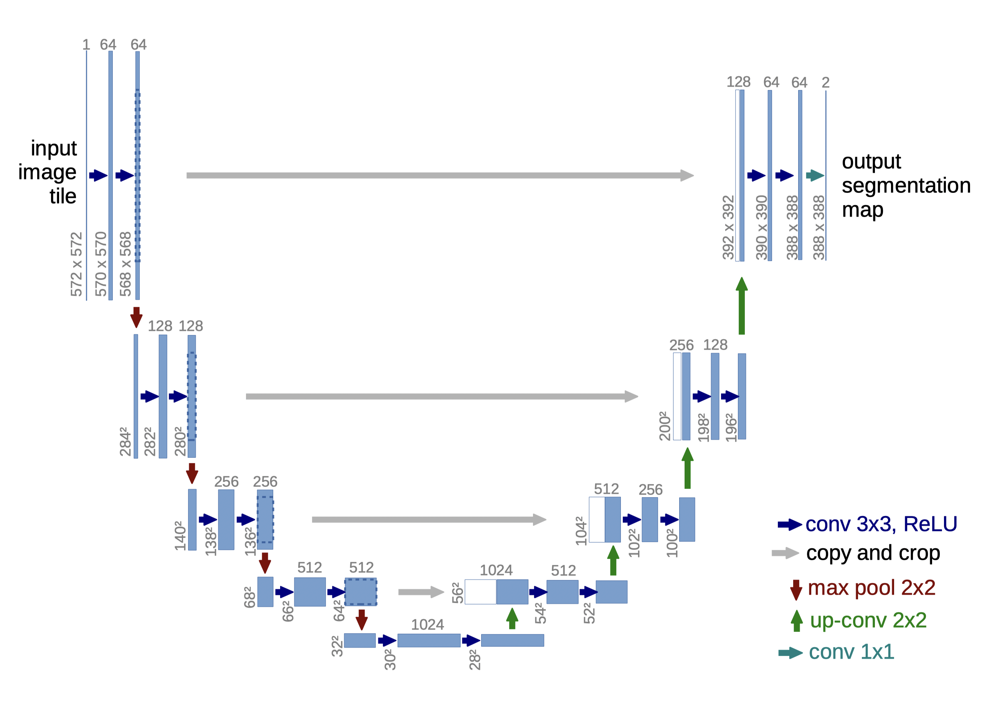
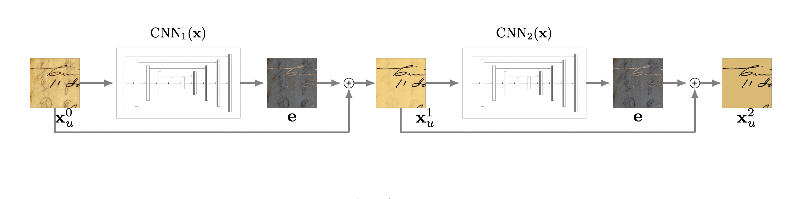
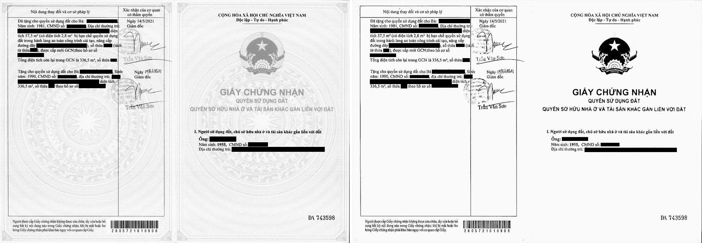

## UNet for Background Removal in [PyTorch](https://github.com/pytorch/pytorch)

### Overview

The original dataset is from [DIBCO challenge](https://vc.ee.duth.gr/dibco2019/),
I've downloaded and done the pre-processing.
You can find it in the `dataset` folder.

The data for training contains 106 images, which is far from enough to feed a
deep learning neural network. Thus I use
[TorchVision](https://github.com/pytorch/vision) `transforms` module
to augment it by randomly scale, crop and rotation.
See `train.py` for detail.

<p align = 'center'>

</p>

I use 2 block of UNet each with 2 levels downsample and 2 levels bicubic
upsampling layer, stack it one after the
other. I found that 2 is the sweet spot between speed and accuracy. Although
more could further improve the result.

<p align = 'center'>

</p>

The model is trained for 1000 epochs with Adam optimizer, initial learning
rate of 0.001 and validate on my custom dataset. Although I'm unable to
public the dataset for privacy reasons, you can take a look at the output under
[result](#result) section.

Loss function used for training is a L2 variance based on the loss function proposed by Sheng
He and Lambert Schomaker, I called it HeSho loss function. In short, the model
tries to learn the difference between the degraded and clean image in contrast
to traditional CNN which learn the clean uniform image, the degration and also
the threshold on the clean image.

### Dependencies

Install the dependencies with:

```
> python3 -m pip install -r requirements.txt
```

### Evaluate

To evaluate the model with some images use `eval.py`

```
> python3 eval.py -h
usage: eval.py [-h] [--load LOAD] [--num_block NUM_BLOCK] F [F ...]

Train segmentation network

positional arguments:
  F                     Images to remove background

optional arguments:
  -h, --help            show this help message and exit
  --load LOAD           path to load weights from
  --num_block NUM_BLOCK
                        number of UNet blocks
```

### Train

If you would like to train the model use `train.py`

```
> python3 train.py -h
usage: train.py [-h] [--data_dir DATA_DIR] [--load LOAD] [--save SAVE] [--num_blocks NUM_BLOCKS]
                [--batch_size BATCH_SIZE] [--crop_size CROP_SIZE] [--lr LR] [--num_epochs NUM_EPOCHS]

Train model

optional arguments:
  -h, --help            show this help message and exit
  --data_dir DATA_DIR   data directory
  --load LOAD           path to load weights from
  --save SAVE           path to save weights
  --num_blocks NUM_BLOCKS
                        number of UNet blocks
  --batch_size BATCH_SIZE
                        batch size
  --crop_size CROP_SIZE
                        crop size
  --lr LR               learning rate
  --num_epochs NUM_EPOCHS
                        number of epochs
```

### Results

<p align = 'center'>

</p>

### Reference

[O. Ronneberger, P. Fischer, T. Brox -- U-net: Convolutional networks for biomedical image segmentation](https://arxiv.org/abs/1505.04597v1)

[S. He, L. Schomaker -- DeepOtsu: Document Enhancement and Binarization using Iterative Deep Learning](https://arxiv.org/abs/1901.06081)
